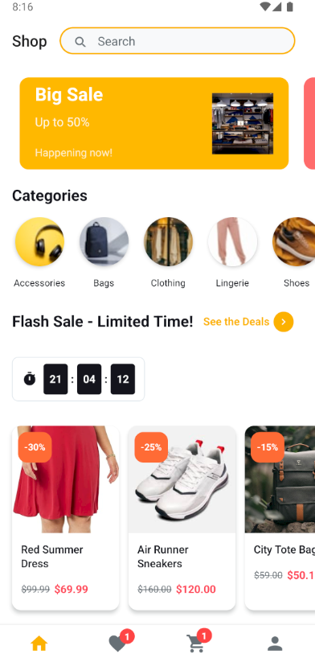
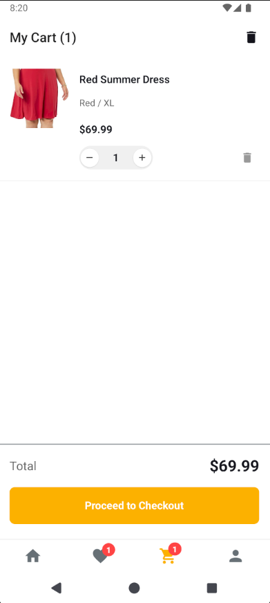
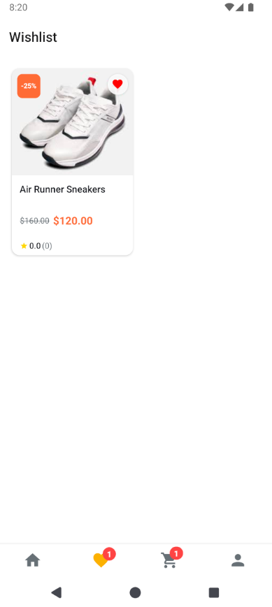
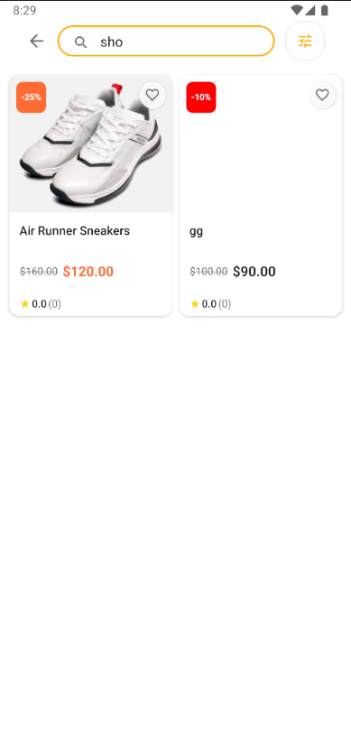
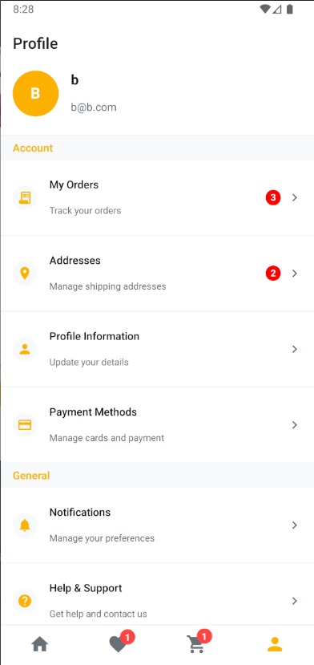
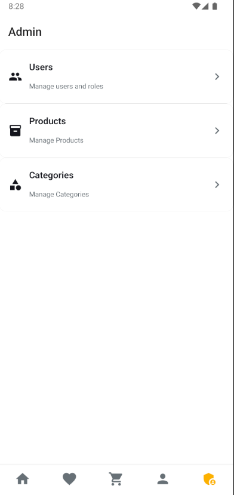
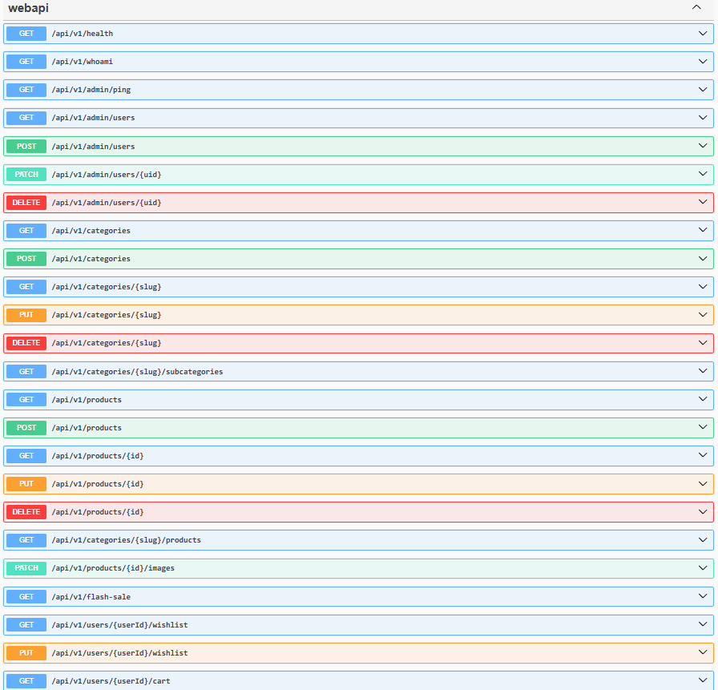

# DuyuBox Commerce

A modern e-commerce mobile app built with React Native (Expo) and .NET 9 Web API. Features Firebase authentication, PostgreSQL database, and a comprehensive admin panel.

<div align="center">
  <table>
    <tr>
      <td></td>
      <td></td>
      <td></td>
      <td></td>
    </tr>
    <tr>
      <td></td>
      <td></td>
      <td></td>
      <td></td>
    </tr>
    <tr>
      <td colspan="4" align="center"></td>
    </tr>
  </table>
</div>
## 🚀 Quick Start

### Prerequisites
- Node.js 18+
- .NET 9 SDK  
- PostgreSQL 13+
- Firebase project
- ngrok (for device testing)

---

## Backend Setup (.NET Web API)

### 1. Install Dependencies
```bash
cd webapi
dotnet restore
```

### 2. Configure Environment Variables

Set these environment variables before running the API:

**Required:**
- `GOOGLE_APPLICATION_CREDENTIALS` - Path to your Firebase Admin SDK JSON file
- `ConnectionStrings__DefaultConnection` - Your PostgreSQL connection string

**Optional:**
- `AdminApiKey` - Custom API key for admin operations (set to any secure value)

**Example (Windows PowerShell):**
```powershell
$env:GOOGLE_APPLICATION_CREDENTIALS="C:\path\to\firebase-adminsdk.json"
$env:ConnectionStrings__DefaultConnection="Host=localhost;Database=my_ecommerce;Username=postgres;Password=mypassword"
$env:AdminApiKey="my-secure-admin-key"
```

**Example (Bash/Linux/macOS):**
```bash
export GOOGLE_APPLICATION_CREDENTIALS="/path/to/firebase-adminsdk.json"
export ConnectionStrings__DefaultConnection="Host=localhost;Database=my_ecommerce;Username=postgres;Password=mypassword"
export AdminApiKey="my-secure-admin-key"
```

### 3. Run the API
```bash
dotnet run
```

The API will start on `http://localhost:5186` and automatically apply database migrations.


---

## Frontend Setup (React Native)

### 1. Install Dependencies
```bash
cd eCommerce
npm install
```

### 2. Configure Firebase

Create `eCommerce/.env` with your Firebase Web App configuration:

```env
EXPO_PUBLIC_FIREBASE_API_KEY=your_api_key_here
EXPO_PUBLIC_FIREBASE_AUTH_DOMAIN=your_project.firebaseapp.com
EXPO_PUBLIC_FIREBASE_PROJECT_ID=your_project_id
EXPO_PUBLIC_FIREBASE_STORAGE_BUCKET=your_project.appspot.com
EXPO_PUBLIC_FIREBASE_MESSAGING_SENDER_ID=your_sender_id
EXPO_PUBLIC_FIREBASE_APP_ID=your_app_id
```

### 3. Configure API Connection

Edit `eCommerce/config/environment.ts`:

**For Emulator/Simulator Testing:**
```typescript
export const USE_NGROK = false;
export const EMULATOR = true;
```

**For Physical Device Testing:**
```typescript
export const USE_NGROK = true;
export const EMULATOR = false;
```

### 4. Start the App
```bash
npx expo start
```

- Press `a` for Android emulator
- Press `i` for iOS simulator  
- Press `w` for web browser


---

## Testing on Physical Devices

### Using ngrok

1. Start ngrok tunnel:
```bash
ngrok http 5186
```

2. Copy the ngrok URL (e.g., `https://abc123.ngrok.io`)

3. In the mobile app, navigate to Settings and set the API URL to your ngrok URL


---

## Firebase Setup

### 1. Create Firebase Project
1. Go to [Firebase Console](https://console.firebase.google.com/)
2. Create a new project
3. Enable Authentication (Email/Password)

### 2. Get Firebase Config
1. Add a Web app to your Firebase project
2. Copy the configuration to `eCommerce/.env`

### 3. Get Admin SDK Key
1. Go to Project Settings → Service Accounts
2. Generate new private key
3. Download the JSON file
4. Set `GOOGLE_APPLICATION_CREDENTIALS` environment variable to the file path


---

## Database Setup

### PostgreSQL Installation

**Ubuntu/Debian:**
```bash
sudo apt-get install postgresql postgresql-contrib
```

**macOS:**
```bash
brew install postgresql
```

**Windows:** Download from [postgresql.org](https://www.postgresql.org/download/windows/)

### Create Database
```sql
CREATE DATABASE your_database_name;
CREATE USER your_username WITH PASSWORD 'your_password';
GRANT ALL PRIVILEGES ON DATABASE your_database_name TO your_username;
```


---

## Features

### Customer Features
- 🔍 Product search and filtering
- ❤️ Wishlist functionality
- 🛒 Shopping cart management  
- 💳 Secure checkout process # WIP
- 📦 Order tracking # WIP
- ⭐ Product reviews and ratings # WIP
- 📍 Address management # WIP


### Admin Features
- 👥 User management
- 📦 Product CRUD operations
- 🏷️ Category management
- 📊 Sales analytics # WIP
- 🔥 Flash sale management # WIP
- 📋 Order management # WIP


---

## Authentication & Roles

The app uses Firebase Authentication with custom claims for role management:

- **Regular Users**: Can browse, shop, and manage their account
- **Admin Users**: Can access the admin panel and manage the store

### Creating Admin Users

**Via Firebase Console:**
1. Go to Authentication → Users
2. Create a new user
3. Add custom claim: `{"role": "Admin"}`

**Via API (requires admin privileges):**
```bash
curl -X POST http://localhost:5186/api/v1/admin/users \
  -H "Authorization: Bearer YOUR_ADMIN_TOKEN" \
  -H "Content-Type: application/json" \
  -d '{"email":"admin@example.com","password":"password","role":"Admin"}'
```


---

## Project Structure

```
DuyuBox_Commerce/
├── eCommerce/                 # React Native frontend
│   ├── app/                  # Expo Router pages
│   ├── components/           # UI components
│   ├── services/            # API and Firebase services
│   ├── hooks/               # Custom React hooks
│   ├── store/               # Zustand state management
│   └── config/              # Environment configuration
└── webapi/                  # .NET 9 backend
    ├── Api/                 # API endpoints
    ├── Application/         # Business logic services
    ├── Domain/             # Entity models
    ├── Infrastructure/     # Database and external services
    └── Security/           # Authentication handlers
```


---

## Available Scripts

### Frontend
```bash
npx expo start          # Start development server
npx expo run:android    # Run on Android emulator
npx expo run:ios        # Run on iOS simulator
npx expo run:web        # Run in web browser
```

### Backend
```bash
dotnet run              # Start API server
dotnet ef migrations add MigrationName  # Create migration
dotnet ef database update              # Apply migrations
```

---

## Troubleshooting

### Common Issues

**"Firebase auth not initialized"**
- Ensure Firebase is imported first in `app/_layout.tsx`
- Check Metro bundler configuration in `metro.config.js`

**Cannot connect to API**
- Verify API is running on port 5186
- For Android emulator, use `10.0.2.2` instead of `localhost`
- For device testing, confirm ngrok URL is active

**Database connection errors**
- Check PostgreSQL is running
- Verify connection string format
- Ensure database exists and user has permissions

**Build issues**
- Clear Metro cache: `npx expo start --clear`
- Reset project: `npm run reset-project`


---

## Development Workflow

### Making Changes

1. **Backend Changes:**
   - Modify API endpoints in `webapi/Api/Endpoints/`
   - Update business logic in `webapi/Application/Services/`
   - Create migrations: `dotnet ef migrations add MigrationName`

2. **Frontend Changes:**
   - Update UI components in `eCommerce/components/`
   - Modify pages in `eCommerce/app/`
   - Update state management in `eCommerce/store/`

### Testing

- **API Testing:** Use Swagger UI at `http://localhost:5186/swagger`
- **Mobile Testing:** Use Expo Go app or build with EAS
- **Database Testing:** Use pgAdmin or any PostgreSQL client


---

## Deployment

### Backend Deployment
```bash
dotnet publish -c Release
```

### Frontend Deployment
```bash
eas build --platform android
eas build --platform ios
```


---

## Contributing

1. Fork the repository
2. Create a feature branch
3. Make your changes
4. Test thoroughly
5. Submit a pull request

---

## Support

For issues and questions:
- Check the troubleshooting section
- Review Firebase and PostgreSQL documentation
- Create an issue in the repository

---

**Note:** This is a development setup. For production, ensure proper security configurations, environment variables, and database backups are in place.